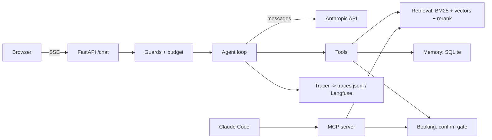

# Day 26: The Portfolio Repo

**Goal:** a repo a recruiter or engineer can understand in five minutes, and that survives a close look from a senior engineer.

## Paper first (20 minutes)

You are the hiring manager. You have 90 seconds per candidate. What do you look for? Usually: a clear one paragraph description, a diagram, numbers that prove it works, evidence of testing, and clean code when you click into one file. Write your README outline to match that order.

## Concepts

**Lead with proof.** Live URL, eval numbers, and retrieval numbers above the fold. Installation instructions below.

**One diagram.** Boxes: client, FastAPI, agent loop, tools, MCP server, retrieval, memory, tracer, Anthropic API. Arrows with labels. Mermaid in the README renders on GitHub.

**Show the process, not just the result.** The eval table, the retrieval iteration table, and the adversarial transcript are what separate you from people who wrapped an API call.

## Step 1: clean the repo

- Folder names match the architecture: `agent/`, `tools/`, `memory/`, `evals/`, `rag/`, `mcp_server/`, `app/`.
- Delete `dayXX.py` scripts or move them into `learning/` with a one line README.
- Every module has a docstring at the top saying what it is.
- `uv run pytest -q` is green. Add tests where a folder has none, even one.
- A `Makefile` or `justfile` with `dev`, `test`, `eval`, `build`, `deploy`.

## Step 2: the README

```markdown
# Clinic Receptionist Agent

An LLM agent that answers questions about a clinic and books appointments, built from
the API up with no agent framework. Live at https://... (demo key in the video).

## What it does
- Answers factual questions with citations from a 50 document knowledge base
- Checks availability and proposes bookings; a human confirmation executes the write
- Remembers returning patients across sessions
- Exposes its capabilities as an MCP server usable from Claude Code

## Numbers
| Metric | Value |
|---|---|
| Coding agent eval, pass rate (30 tasks) | baseline 0.63 -> 0.80 after one prompt change |
| Retrieval recall@5 (25 questions) | 0.56 vector -> 0.88 hybrid + rerank |
| Answer correctness with citations | 0.84 |
| Adversarial cases handled | 20 / 20 |
| p50 latency per turn | 3.1 s |
| Mean cost per turn | $0.018 |

## Architecture
(mermaid diagram)

## How it is built
- `agent/` the loop: stop conditions, error budget, context budget, tracing
- `memory/` trimming, structured summaries, SQLite store with per user scopes
- `evals/` harness with deterministic and LLM judge scorers, judge agreement checked
- `rag/` chunking with context, BM25 + vectors with RRF, cross encoder rerank
- `mcp_server/` three tools, tests, description tests with the model
- `app/` FastAPI, SSE streaming, cost caps, guards, confirmation gate

## Run it
(three commands)

## What broke and what I learned
Link to WRITEUP.md

## Posts
- How an agent loop works
- How I know my agent got better
- Measuring retrieval separately from generation
```

Replace the numbers with yours. Never invent one.

## Step 3: the diagram



## Step 4: a senior engineer's click

Open three files you are least proud of. Fix them. Typical: a 200 line function, a bare `except`, a hardcoded path. Then ask Claude Code to review the repo for correctness only and fix what is real.

## Exercise, without AI

Read your README aloud. Anything you cannot explain in a sentence gets cut or fixed.

## Check yourself

1. What is above the fold and why?
2. Can someone run it in three commands?
3. Is every number in the README reproducible from a command in the repo?
4. What did the senior engineer's click find?

## Done when

- README complete with real numbers and a diagram.
- Tests green, repo clean, tagged `v0.1`.
- Sticky note: "What broke that I am proud of fixing?"
